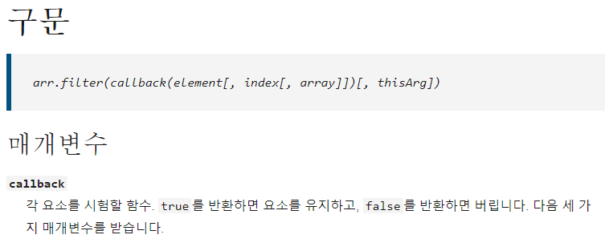

# 화살표 함수(Arrow function)은 언제, 왜 써야 할까

먼저, js에서 **this**는 함수 내에서 함수 호출 맥락을 의미한다. <br />
이때, 호출 맥락이라는 것은 호출하는 상황에 따라서 달라진다는 의미로, 함수를 어떻게 호출하느냐에 따라서 this가 가리키는 대상이 달라진다는 뜻이다. 

```
const person = {
  name : "Mike",
  getName() {
    return this.name;
  }
}

// 1
console.log(person.getName()); // Mike

// 2
const man = person.getName;
console.log(man()); // undefined
```

첫 번째 출력의 경우, this는 `person.getName()`으로 호출되었기 때문에 `person`을 this의 대상으로 정했지만, <br />
두 번째 출력의 경우, man이라는 변수에 person.getName()이라는 함수가 값으로 저장되어있기 때문에 `person`이 아닌 `window`를 this의 대상으로 정했기 때문에 값을 찾지 못한 것이다. <br />

> 그렇다면 언제 이런 실수를 하게 될까?

주로 콜백 함수에서 this를 사용할 때, 호출 맥락에 따라 this의 값은 달라지게 된다. <br />

### 화살표 함수와 this

화살표 함수는 ES6에서 추가된 스펙으로, 기존 함수에 비해 더욱 간결하게 함수를 표현할 수 있는 특징을 가지고 있다. <br />
또, 화살표 함수 안에서의 this는 **항상 상위 스코프의 this를 가리킨다.** 이를 **Lexical this**라고 한다. <br />
그럼 앞서 봤던 예제 코드를 화살표 함수를 통해 우리가 의도한 동작으로 고칠 수 있을 것이다.

```
const person = {
  name : "Mike",
  getName : () => {
    return this.name;
  }
}

// 1
console.log(person.getName()); // Mike

// 2
const man = person.getName;
console.log(man()); // Mike
```

이처럼 화살표 함수를 사용하여 this가 `person`을 가리키도록 고정되었기 때문에 의도대로 작동시킬 수 있다.

따라서 우리는 콜백 함수에서 this를 참조시킬 때 this가 가리킬 값을 주의해야 하며, 많은 경우 프로그래머가 의도한 동작은 화살표 함수에서의 this와 같을 것이다.

<br />

# 고차함수 (Higher-Order Function)

> 함수를 인자로 받거나(callback function) 또는 함수를 반환함으로써 작동하는 함수

- 대표적인 예로 `Array.prototype.map`, `Array.prototype.filter` 등이 언어 내부에 포함된(built-in) 고차함수이다.



filter() 메서드는 콜백 함수에 의해 걸러진 엘리먼트들만을 가진 새로운 배열을 만들어 낸다.

```
const persons = [
  { name: 'Peter', age: 16 },
  { name: 'Mark', age: 18 },
  { name: 'John', age: 27 },
  { name: 'Jane', age: 14 },
  { name: 'Tony', age: 24},
];
const fullAge = persons.filter(person => person.age >= 18);
console.log(fullAge);
```

고차 함수를 사용하면 로직 내의 어떤 버그를 수정할 때 프로그램 전체에 퍼져 있는 패턴의 모든 사례를 고치는 대신, 한 번의 수정이면 된다. <br />
이는 좋은 추상화의 사례이다. 다음 예제를 보면 똑같은 코드지만 하나는 고차함수를 이용하여 추상화하였다.

```
// 1
let total = 0, count = 1;
while (count <= 10) {
    total += count;
    count += 1;
}

// 2
sum(range(1, 10));
```

이처럼 sum, reange(n, m)과 같이 명백한 이름을 지정해주면 코드를 읽는 사람은 구현의 세부 사항을 해석할 필요 없이<br />
코드가 어떤 동작을 하는지 쉽게 이해할 수 있다.

<br />

# Call 메서드

> 모든 함수에서 사용할 수 있으며, this를 특정값으로 지정할 수 있다.

```
const mike = {
  name : "Mike",
};

function showThisName() {
  console.log(this.name);
}

showThisName(); // ""
showThisName().call(mike); // "Mike"
```

즉 call을 이용하여 this로 사용할 객체(예제에서는 mike)를 넘기면 해당 함수에서 주어진 객체의 메서드인 것처럼 사용할 수 있다. <br />
위의 코드에서 다음과 같이 update라는 함수를 추가해줬다.

```
function update(age, job) {
  this.age = age;
  this.job = job;
}

update.call(mike, 20, "student");
console.log(mike); // { name : "Mike", age : 20, job : "student" }
```

# Apply 메서드

- call은 일반적인 함수와 마찬가지로 매개변수를 직접 받지만, apply는 `매개변수를 배열`로 받는다는 차이가 있으며, 이를 제외하면 call과 완전히 같다.

다음은 call에서 봤던 예제를 apply로 바꾼 버전이다.

```
const mike = {
  name : "Mike",
};

function showThisName() {
  console.log(this.name);
}

function update(age, job) {
  this.age = age;
  this.job = job;
}

update.apply(mike, [20, "student"]); // 매개변수를 배열로 전달!
console.log(mike); // { name : "Mike", age : 20, job : "student" }
// call과 동일한 결과를 얻었다.
```

따라서 apply는 배열 요소를 함수의 매개변수로 사용할 때나, 몇 개의 인자를 입력받을지 정해져있지 않은 **가변인자** 함수에서 유용해진다. <br />

```
const nums = [3, 10, 1, 6, 4];

const minNum1 = Math.min(3, 10, 1, 6, 4); // 1
const minNum2 = Math.min(num); // NaN
const minNum4 = Math.min.apply(null, num); // 1
```

원래라면 우리는 가변인자 함수인 Math.min을 사용할 때 매개변수로 넣어줄 배열 nums을 풀어줘야 하지만<br />
apply를 사용하면 예제에서처럼 깔끔하게 사용이 가능하다.
